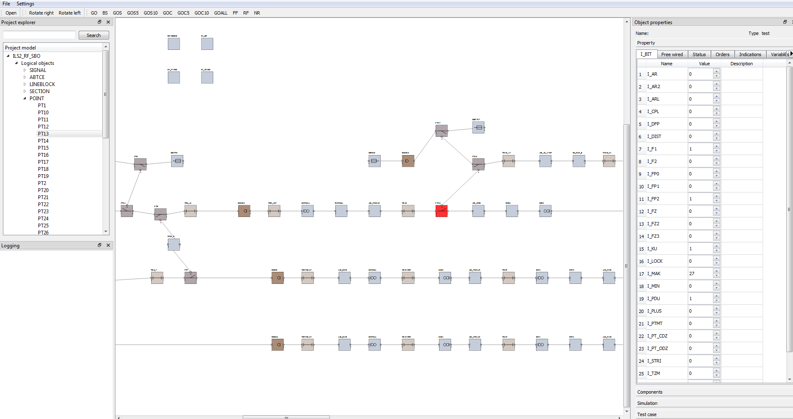

## Test tool
---
### Назначение
**Test tool** - программа позволяющая производить отладку в удобной визуальной форме
### Возможности
1. Графическое отображение топологии станции в привязке к конкретным экземплярам в ПО
2. Подключение к имитатору железа
3. Отладка функционала в режиме реального времени
4. Запись и сохранение воздействий в тестовые кейсы
5. Пошаговое выполнение тестовых кейсов (составленных в ручную или сохранённых ранее)
6. Загрузка логов с пересчётами логики

### Пример станции

    

---